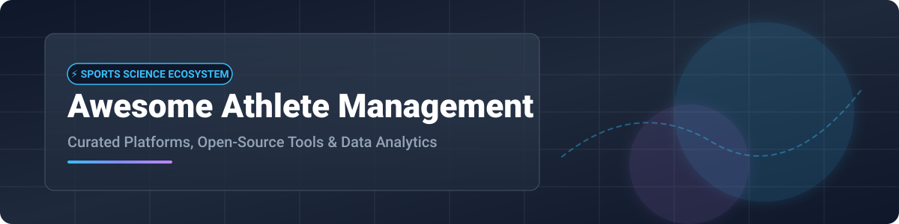

# 🏆 Awesome Athlete Management System Ecosystem

> **A curated list of elite SaaS products, open-source GitHub projects, wearable data pipelines, and sports science platforms for athlete monitoring, injury risk assessment, training load management, and wellness surveys.** 🏋️‍♂️📊⚽

---

## 💡 Overview & Market Insights 📈

> [!NOTE] 
> **Market Size & Industry Structure (2026)**  
> The global **Athlete Management System (AMS)** market is estimated at **$1.2 Billion to $1.5 Billion**, projected to reach **$3.8 Billion by 2032** growing at a CAGR of ~14.5%. The market is **moderately fragmented**, with enterprise leaders like **Teamworks** and **Catapult** acquiring key niche platforms (e.g., Smartabase, Kinduct) while specialized SaaS vendors and open-source stacks address high-performance sub-niches and research academic institutions.

---

## 📋 Table of Contents 📑

- [🏢 Enterprise SaaS Platforms](#-enterprise-saas-platforms)
- [🔓 Open-Source GitHub Repositories](#-open-source-github-repositories)
- [🤝 How to Contribute](#-how-to-contribute)
- [⚖️ Disclaimer & Security Notice](#-disclaimer--security-notice)

---

## 🏢 Enterprise SaaS Platforms 💼

Centralized performance, medical, training-load, and wellness monitoring platforms tailored for elite professional teams, collegiate athletics, and military human performance programs.

| 🏢 Platform | 💰 Pricing Tier | 🎁 Free Tier / Trial Limit | 📊 Company Size (Valuation / Revenue) | 📝 Description |
| :--- | :--- | :--- | :--- | :--- |
| **[Teamworks AMS (Smartabase)](https://teamworks.com/smartabase)** 🚀 | Enterprise quote (~$15,000/year base) | ❌ No free tier; demo upon request | 💎 **Valuation:** ~$1.2 Billion 💵 **Revenue:** ~$81.5M - $100M+ | Leading athlete management system for integrated performance teams—centralizing load, testing, nutrition, medical, and survey data. |
| **[Catapult AMP](https://www.catapult.com/)** 📡 | Enterprise quote (~$10,000/year base) | ❌ No free tier; custom pilot demo | 💎 **Valuation:** ~$670 Million (Market Cap) 💵 **Revenue:** ~$140.7 Million | Athlete monitoring & tracking platform tightly integrated with wearable microtechnology and video intelligence. |
| **[Kitman Labs](https://www.kitmanlabs.com/)** 🧠 | Enterprise quote (~$12,000/year base) | ❌ No free tier; demo upon request | 💎 **Valuation:** ~$250M+ (Series C: $52M) 💵 **Revenue:** ~$5.75M - $15M+ | Intelligence platform for athlete availability, injury risk analytics, and performance decision support. |
| **[Kinduct / Edge10](https://www.kinduct.com/)** 🏥 | Enterprise quote (~$8,000/year base) | ❌ No free tier; scheduled trial demo | 💎 **Valuation:** ~$50M - $100M 💵 **Revenue:** ~$10M - $25M | Comprehensive performance data management supporting multi-disciplinary staff workflows and longitudinal athlete profiles. |
| **[CoachMePlus](https://coachmeplus.com/)** ⚡ | Custom tier starting at **$200/month** | ❌ No free tier; 14-day demo trial | 💎 **Valuation:** ~$10M - $25M 💵 **Revenue:** ~$5M - $10M | Applied sports science and daily athlete readiness tracking system with wearable data integrations. |
| **[BridgeAthletic](https://www.bridgeathletic.com/)** 🏋️ | Coach plan starting at **$119/month** | ⌛ **14-day free trial** (Full feature access) | 💎 **Valuation:** ~$10M - $30M 💵 **Revenue:** ~$3M - $8M | Strength & conditioning platform enabling custom workout delivery, load tracking, and movement assessment. |

---

## 🔓 Open-Source GitHub Repositories 💻

Community-driven, transparent, and self-hosted tools for athlete tracking, training load calculations (ACWR, TRIMP), and endurance analytics.

| 📦 Repository & Link | ⭐ Star Count | 🛠️ Core Tech / Focus | 📜 Description |
| :--- | :---: | :--- | :--- |
| **[GoldenCheetah](https://github.com/GoldenCheetah/GoldenCheetah)** 🐆 |  | C++ / Qt / Performance Analytics | Performance analysis software for endurance athletes; imports data from power meters, HR monitors, and GPS. |
| **[OpenTracks](https://github.com/OpenTracksApp/OpenTracks)** 📍 |  | Java / Android / GPS Tracking | Privacy-respecting sport tracking application for logging workouts and telemetry without data leakage. |
| **[Fitly](https://github.com/ethanopp/fitly)** 🏃 |  | Python / Web Analytics | Self-hosted web analytics dashboard tailored for endurance athletes and training volume management. |
| **[Athlete Data Warehouse](https://github.com/pgalko/athlete_data_warehouse)** 🗄️ |  | Python / SQL / Data Pipeline | Tool for bulk downloading, formatting, and SQL storage of exercise, training, nutrition, and health data from multiple trackers. |
| **[REGMON](https://github.com/REGmon-project/regmon)** 📋 |  | PHP / Web App / Research AMS | Full open-source web application for athlete monitoring in sport practice & research with custom forms and GDPR compliance. |
| **[SportIQ](https://github.com/mwasifanwar/SportIQ)** 🎯 |  | Python / Computer Vision | Computer vision platform providing biomechanical pose estimation and tactical analysis for athlete optimization. |
| **[AthleteLoadMonitor](https://github.com/SaxionAMI/AthleteLoadMonitor)** ⏱️ |  | R / Shiny / Load Insights | Interactive tool for team sports coaches integrating sensor data with subjective wellness questionnaires to predict training load risk. |
| **[Open Athletics](https://github.com/MenachoIvan/open-athletics)** 🚴 |  | JavaScript / Strava API | Open performance dashboard connecting to Strava for athletic volume, efficiency, and training load tracking. |

---

## 🤝 How to Contribute 🛠️

Contributions are welcome to keep this ecosystem comprehensive and accurate! 

1. **Fork** the repository 🍴
2. **Add or update** entries in `README.md` following the table formats 📝
3. Verify links, pricing details, and repository metrics 🔍
4. **Submit a Pull Request** with a brief summary of additions 🚀

---

## ⚖️ Disclaimer & Security Notice 🔐

> [!WARNING]
> - This repository is a community-curated collection for informational and educational purposes.
> - **Data Privacy & Compliance**: Athlete management platforms handle sensitive physiological and medical records. Ensure proper compliance with **GDPR**, **HIPAA**, and local sports-medicine regulations when deploying self-hosted or commercial solutions.

---

Made with ❤️ for Sports Scientists, S&C Coaches, Bio-mechanists, and Performance Directors worldwide.

